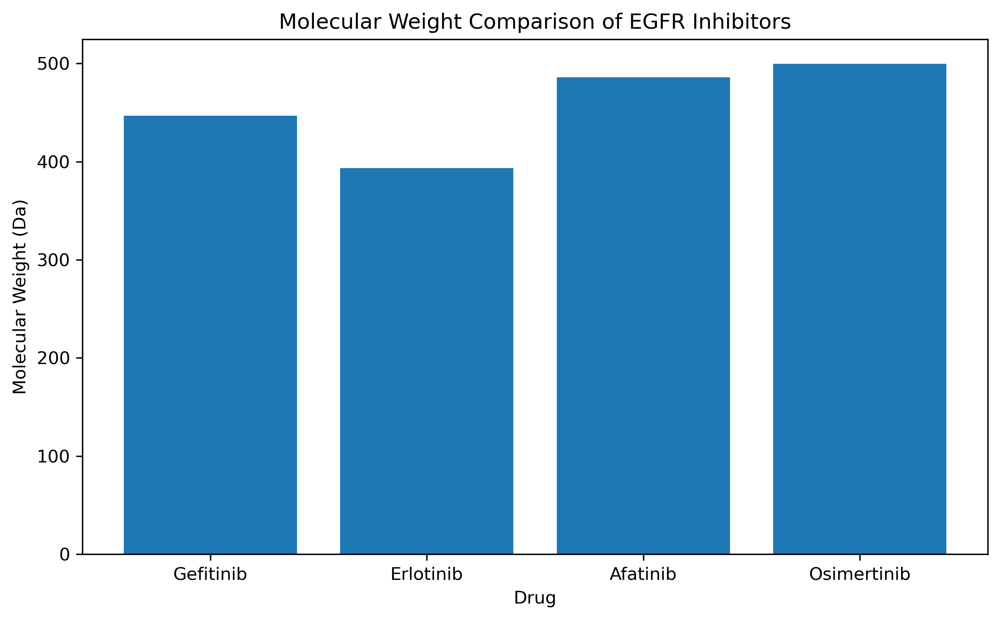
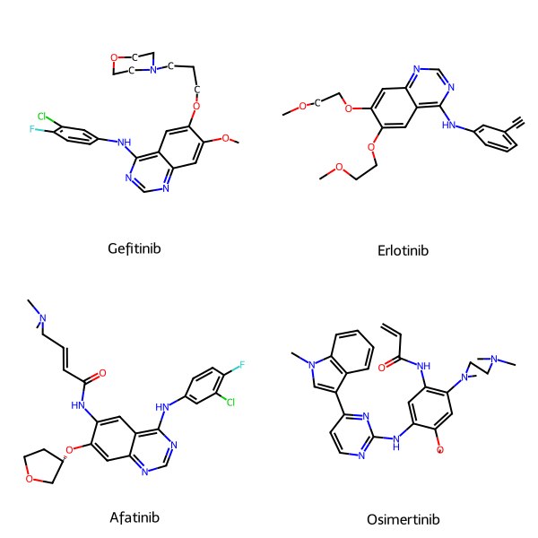
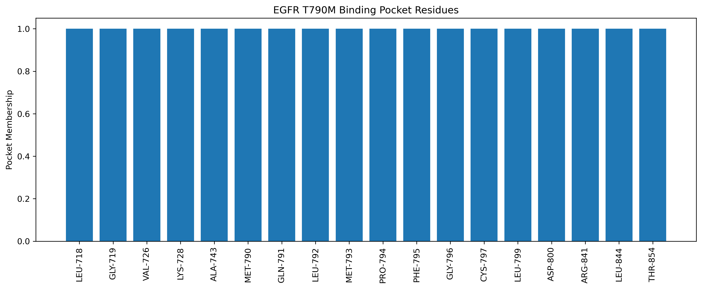
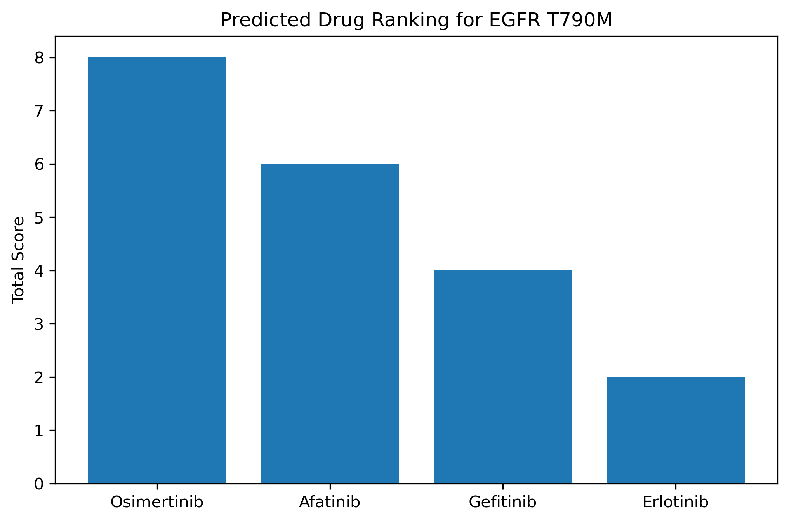
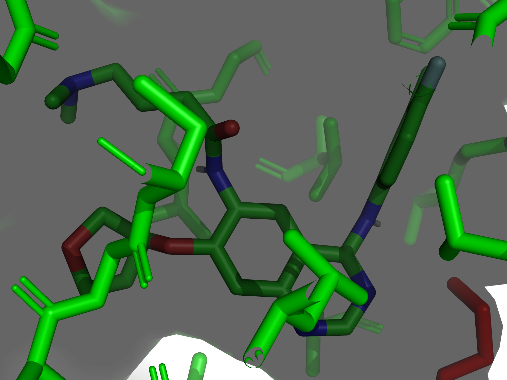
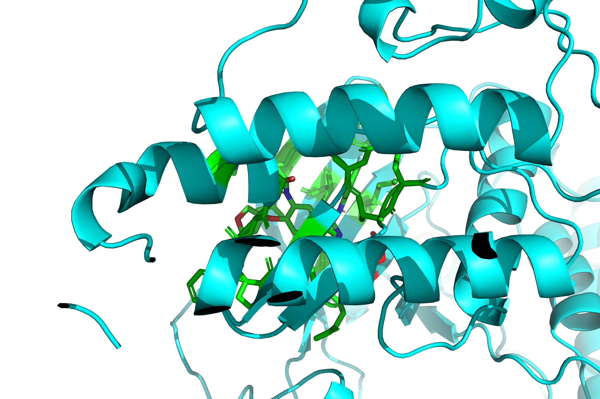

# EGFR T790M Computational Drug Discovery

## Overview

This project investigates the interaction of FDA-approved EGFR inhibitors with the **EGFR T790M resistance mutation**, a major cause of acquired resistance in non-small cell lung cancer (NSCLC).

Using a computational drug discovery workflow, molecular properties were analyzed, binding pockets were identified, molecular docking was performed, and protein-ligand interactions were visualized to compare inhibitor performance.

---

## Objective

To evaluate and rank clinically relevant EGFR inhibitors against the EGFR T790M mutant receptor using molecular docking and structural analysis.

---

## Target Protein

| Property          | Value                                   |
| ----------------- | --------------------------------------- |
| Protein           | Epidermal Growth Factor Receptor (EGFR) |
| Mutation          | T790M                                   |
| PDB ID            | 3IKA                                    |
| Disease Relevance | Non-Small Cell Lung Cancer (NSCLC)      |

---

## Tested Inhibitors

* Gefitinib
* Erlotinib
* Afatinib
* Osimertinib

---

## Computational Workflow

```text
Protein Retrieval (PDB)
        ↓
Protein Preparation
        ↓
Ligand Preparation
        ↓
Molecular Property Analysis
        ↓
Binding Pocket Identification
        ↓
AutoDock Vina Docking
        ↓
Binding Affinity Ranking
        ↓
PyMOL Visualization
        ↓
Interaction Analysis
```

---

## Tools and Libraries

### Programming

* Python

### Bioinformatics

* BioPython
* RDKit

### Molecular Docking

* Meeko
* AutoDock Vina v1.2.7

### Visualization

* PyMOL

### Data Analysis

* Pandas
* NumPy
* Matplotlib

---

# Molecular Property Analysis

The physicochemical properties of the inhibitors were calculated using RDKit.

| Drug        | Molecular Weight (Da) | LogP | H-Bond Donors | H-Bond Acceptors | Rotatable Bonds |
| ----------- | --------------------- | ---- | ------------- | ---------------- | --------------- |
| Gefitinib   | 446.91                | 4.28 | 1             | 7                | 8               |
| Erlotinib   | 393.44                | 3.41 | 1             | 7                | 10              |
| Afatinib    | 485.95                | 4.39 | 2             | 7                | 8               |
| Osimertinib | 499.62                | 4.51 | 2             | 7                | 10              |

### Molecular Weight Comparison



---

# EGFR Inhibitor Structures

Visualization of the molecular structures analyzed in this study.



---

# Binding Pocket Analysis

The binding site was identified using the co-crystallized ligand present in the crystal structure.

### Binding Pocket Residues

* LEU718
* GLY719
* PHE723
* VAL726
* ALA743
* LYS745
* MET790
* GLN791
* LEU792
* MET793
* PRO794
* PHE795
* GLY796
* CYS797
* ASP800
* ASN842
* LEU844
* THR854
* ASP855

### Binding Pocket Visualization



---

# Molecular Docking

### Docking Parameters

| Parameter        | Value                |
| ---------------- | -------------------- |
| Docking Software | AutoDock Vina v1.2.7 |
| Center X         | -11.849              |
| Center Y         | 16.897               |
| Center Z         | 31.836               |
| Grid Size        | 20 × 20 × 20 Å       |
| Exhaustiveness   | 8                    |

---

## Docking Results

| Drug        | Binding Affinity (kcal/mol) |
| ----------- | --------------------------- |
| Afatinib    | -8.241                      |
| Osimertinib | -8.121                      |
| Gefitinib   | -8.103                      |
| Erlotinib   | -7.442                      |

---

## Docking Ranking

1. Afatinib
2. Osimertinib
3. Gefitinib
4. Erlotinib

### Docking Score Comparison



---

# Protein–Ligand Interaction Visualization

### Afatinib Bound to EGFR T790M

The top-ranked docking pose of Afatinib was visualized using PyMOL.



---

### Final Binding Pose



---

# Key Findings

* Afatinib demonstrated the strongest predicted binding affinity (-8.241 kcal/mol).
* Osimertinib and Gefitinib showed comparable docking performance.
* Erlotinib displayed the weakest predicted binding among the tested inhibitors.
* Multiple interactions were observed near the T790M mutation region.
* The ATP-binding pocket residues were consistent with known EGFR inhibitor binding sites.

---

# Project Structure

```text
EGFR_T790M_Computational_Drug_Discovery
│
├── data
│   ├── ligands
│   └── pdb
│
├── notebooks
│   └── drug_discovery.ipynb
│
├── results
│   ├── docking
│   ├── images
│   └── reports
│
├── tools
│
├── README.md
├── requirements.txt
└── .gitignore
```

---

# Future Improvements

* Molecular Dynamics (MD) simulations
* MM/PBSA free energy calculations
* Virtual screening of larger compound libraries
* Machine Learning-assisted hit prioritization
* AI-based drug discovery integration

---

# Author

**Nirupam Joarder**

B.Tech Biotechnology Engineering
National Institute of Technology Rourkela

GitHub: https://github.com/biotech-py

---

## Conclusion

This project demonstrates a complete computational drug discovery workflow, beginning with protein and ligand preparation and ending with molecular docking, interaction analysis, and structural visualization.

The workflow provides a reproducible framework for evaluating small-molecule inhibitors against clinically relevant cancer targets such as EGFR T790M.
